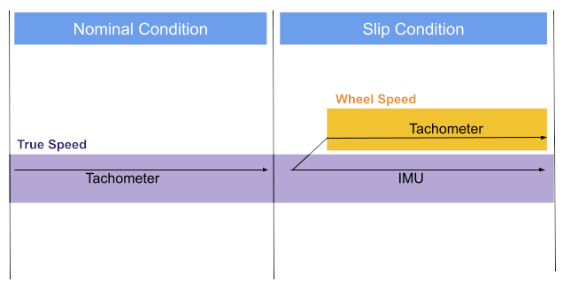
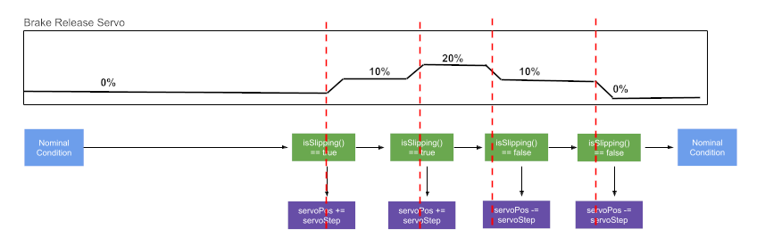

# BCM 

Brake Control Module


This library is in charge of predicting slip as well as intervening during unstable conditions. These two tasks are labeled as:
- Slip Prediction
- Slip Regulation

## Slip Prediction

By comparing the reported tachometer value and imu readings for acceleration, the tractive state of the wheels can be estimated. By combining the readings of both the IMU and tachometer, a true speed is derived that serves as a reference for the wheels. Should a deviance be observed, it is seen as a slip.



During nominal conditions, the wheel speed is deemed as accurate and is trusted to be the true speed. Whenever a slippage event is believed to occur, the imu is used to update the true speed as the wheel speed cannot be deemed as reliable. 

```
bool isSlipping()
```
Return Values:
- **true**  : Nominal traction 
- **false** : Slip is present

```
float getTrueVel() 
```
Returns the most accurate estimate of the true velocity of the bike. Obtained from both the tachometer and IMU extrapolation.


## Slip Regulation

Reacting to a loss in grip results in a command for brake release. This is carried out through a servo which is directly connected to the brake lever. 



Whenever a slip condition is detected, the servo is progressively activated until the slippage ceases. After traction is re-established, the brake servo is slowly deactivated.

```
void enableIntervention()
```
Enables the braking regulation functionality

```
void disableIntervention()
```
Disables the braking regulation functionality
```
bool isLimiting()
```
Returns the current status of the regulation system. Return values:
- **true** : Brake force is currently limited
- **false** : Brake force is unrestricted